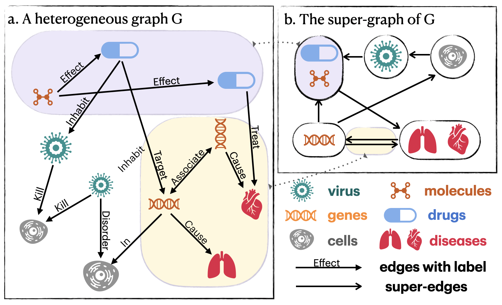

# The GripNet Architecture
The GripNet is an effective and efficient framework to learn node representations on heterogeneous graphs (or Knowledge Graphs) for the downstream (multi-relational) link prediction, (multi-class) node classification, and visualization. It is also a natural framework for data integration (i.e. integrating multiple datasets).

## The Super-graph
We define ***super-graph*** to describe the data representation and the information propagation processes within the GripNet models. Each super-nodes on a super-graph

